# LeetSummarizer

This is a Chrome extension that summarizes users' code on LeetCode in plain English. It breaks down the code into simple steps, explaining the logic and functionality in clear, easy-to-understand language.

## Table of Contents

- [LeetSummarizer](#leetSummarizer)
    - [Table of Contents](#table-of-contents)
    - [Data Information](#data-information)
    - [Data Card](#data-card)
    - [Data Source](#data-source)
    - [Project Workflow](#project-workflow)
    - [Tools Used In Project](#tools-used-in-project)
    - [Data Pipeline Setup](#data-pipeline-setup)
    - [Features](#features)
        - [Tracking](#tracking)
        - [Logging](#logging)
        - [DVC](#dvc)
        - [Monitoring](#monitoring)
        - [Load Balancing](#load-balancing)
    - [CI-CD](#ci-cd)
    - [Model](#model)
    - [Model Components](#model-components)
    - [Model Deployment](#model-deployment)
    - [Drift Detection](#drift-detection)
    - [High Level End-to-End Design Overview](#high-level-end-to-end-design-overview)
    - [User Interaction](#user-interaction)
        - [Building Chrome Extension](#building-the-chrome-extension)
        - [Data Handling Through API Calls](#data-handling-through-api-calls)
        - [Model Integration](#model-integration)
        - [Feedback to the Chrome Extension](#feedback-to-the-chrome-extension)
        - [Persistence in Firestore](#persistence-in-firestore)


<!-- ---
---

# Milestone : Data Pipeline -->

## Data Information
The dataset provided encompasses a comprehensive compilation of LeetCode questions, coupled with their corresponding code solutions and concise summaries. Reflecting the essence of algorithmic problem-solving, each entry encapsulates a unique challenge and its resolution, offering valuable insights into various coding paradigms and techniques. This repository serves as a reservoir for developers and coding enthusiasts alike, fostering skill development and proficiency enhancement in algorithmic problem-solving. While distinct from traditional transactional datasets, this collection plays a pivotal role in honing programming aptitude and fostering a deeper understanding of algorithmic complexities.


## Data Card
| Variable Name | Role | Type | Description |
|-----------------|-----------------|-----------------|-----------------|
| Question | Feature | String | A concise representation of the LeetCode problem statement. |
| Code | Feature | String | The implemented solution for the corresponding LeetCode question. |
| Plain Text | Target | String | A succinct summary providing an explanation of the implemented code. |


## Data Source
The dataset utilized in this project was generated internally to suit the specific requirements and objectives of the analysis. This self-curated dataset ensures relevance and alignment with the research goals, allowing for tailored insights and interpretations. By crafting our own data, we maintain control over its quality and suitability for the intended analyses.

## Project Workflow
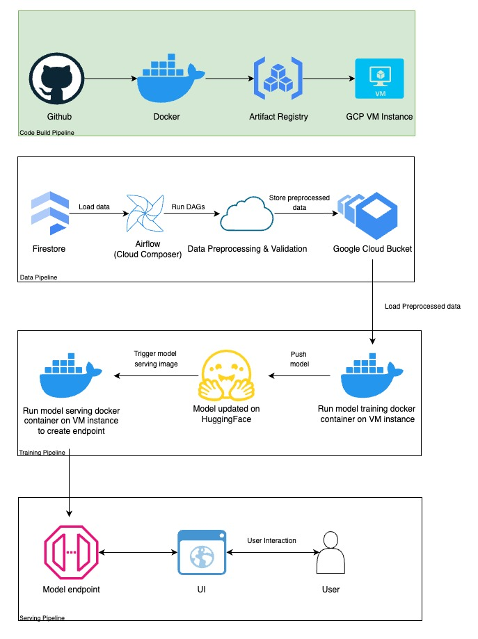

## Tools Used In Project

<p align="center">
  <a href="">
    
  </a>
</p>

## Data Pipeline Setup
Setting up pipeline starts with setting up Apache Airflow. Apache Airflow is an open-source platform used to programmatically author, schedule, and monitor workflows. It enables users to orchestrate complex data pipelines with ease and reliability.

Install apache using the below command.
```bash
pip install apache-airflow
```

Next, start airflow's scheduler and web server to manage Directed Acyclic Graphs (DAGs) via a browser-based UI, where you define tasks and their dependencies for workflow automation.

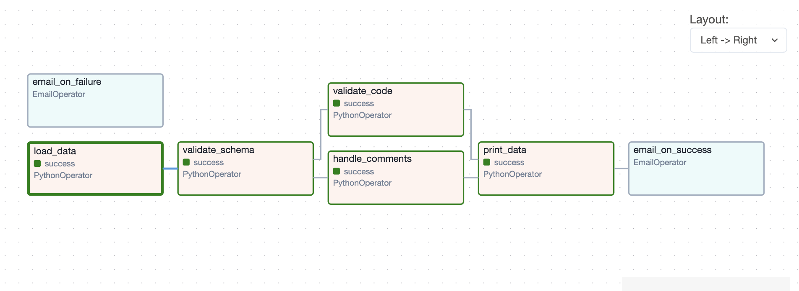


<!-- ## 5. Data Pipeline Components
The data pipeline comprises a single Directed Acyclic Graph (DAG) module encompassing five distinct tasks. Here's an overview of each task:

<!-- IMAGE GOES HERE -->
<!-- 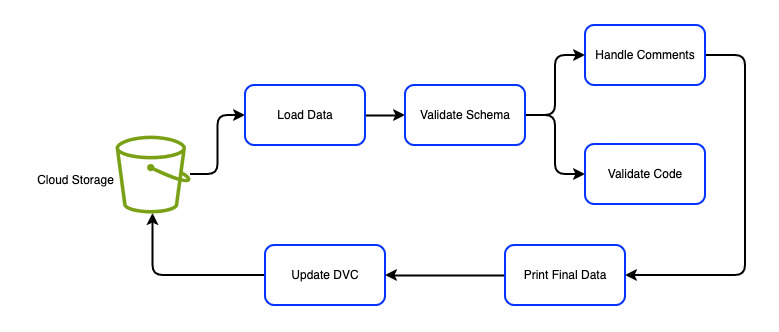 -->
<!-- 
1. task_load_data : Initiates the execution of the load_data.py Python script to retrieve data from the source, which in our case is Firebase.

2. task_validate_schema : Utilizes validate_schema.py to ensure the integrity of the 'Python code' data stored within the dataset by validating its schema.

3. task_handle_comments : Executes handle_comments.py to eliminate comments from the 'Python code' data stored in the dataset, streamlining its structure.

4. task_validate_code : Utilizes validate_code.py to verify the syntactical correctness of the 'Python code' data stored in the dataset, ensuring adherence to programming standards.

5. task_print_final_data : Facilitates the display of the refined and validated dataset, providing a clear view of the processed data.

6. task_dvc_pipeline : Executes dvc_pipeline.py to update data versioning.

The below image shows the executed DAG pipeline. -->
<!-- IMAGE GOES HERE -->
<!-- 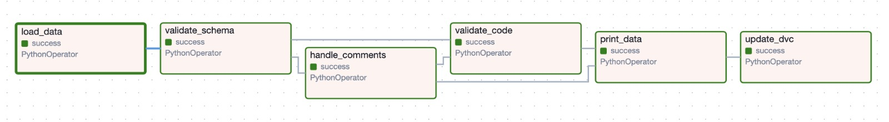 -->


## Features
#### Tracking : 
For this task, Git serves as a robust version control system, facilitating project tracking through its branching and tagging capabilities. It enables teams to monitor changes, collaborate efficiently, and maintain a coherent history of project evolution. 

#### Logging : 
- The project incorporates comprehensive try-except blocks within functions, capturing logs of successful executions or errors. These logs can be accessed in the logs/ directory created in the local machine after running the pipeline.
- The logs generated while deploying a model to an endpoint via fast api have being stored in cloud logging.
    
<!-- IMAGE GOES HERE -->
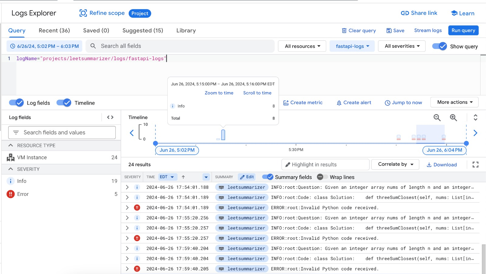

Logging provides visibility into the execution process and facilitating error tracking and resolution. 

#### DVC :
DVC (Data Version Control) plays a crucial role in managing and versioning large datasets efficiently. To facilitate the use of DVC in the project, a bucket was created in Google Cloud Storage.
<!-- IMAGE GOES HERE -->
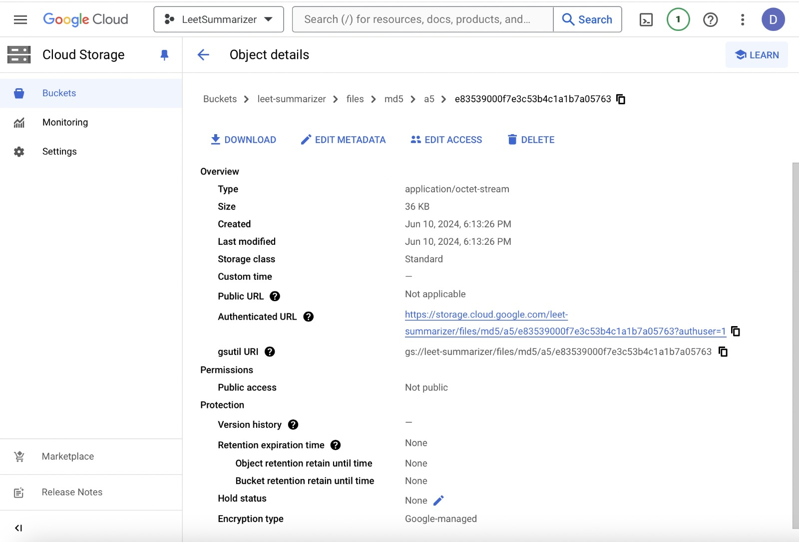

#### Experimentation :
Experimentation plays a major role in figuring out which model is better. <Give use of mlflow here>

| Model | Avg. Roguel Value | Avg. Similarity Value | Loss Value |
|-----------------|-----------------|-----------------|-----------------|
| Llama3 | 0.351 | 0.187 | 0.211 |
| MistralAI | 0.394 | 0.195 | 0.188 |

We performed monitoring using MLFlow and GCP

MLFlow Tracking
<!-- IMAGE GOES HERE -->
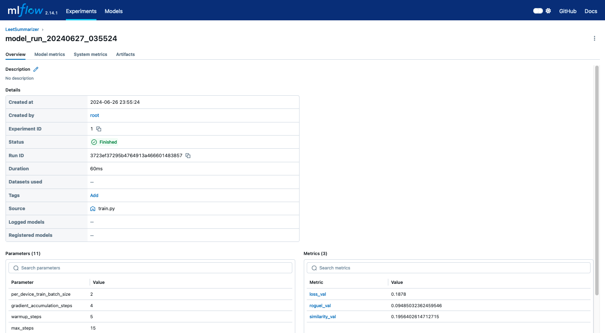

GCP Tracking
<!-- IMAGE GOES HERE -->
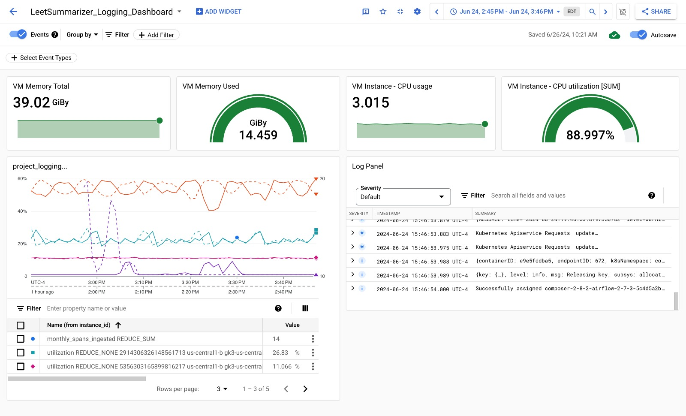

#### Load Balancing
For autoscaling, compute engine offers us to automate addition or removal of VM instances from a managed instance group. Thus, we can add our VM into the instance group to handle load balancing. Due to the resource restriction (usage of L4 GPU based instance), the same has not been implemented in our project.


```
NOTE : SchemaGen and StatisticsGen have been omitted from our pipeline as they are not pertinent to our project's dataset structure since we are dealing with strings whereas the aforementioned libraries are only pertinent for categorical/numerical data types. However, it is advised to consider utilizing these libraries to enhance data handling capabilities.
```

<!-- ## Running The Project
Ensure that the following prerequisites are in place before running the project:
- Docker
- Airflow

<br>

Once all requirements are satisfied, execute the following commands to run the project:

Clone the GitHub repository
```bash
% git clone https://github.com/deepanshgandhi/LeetSummarizer.git
% cd LeetSummarizer
```

<br>

Download the docker image
```bash
LeetSummarizer % docker pull deepanshgandhi/leetsummarizer
```

<br>

Run the docker container
```bash
LeetSummarizer % docker-compose up -d
```

<br>

```
NOTE : Google service key is required in order to execute the project successfully. Please contact the team to generate your personal service key.

The service key should be added in the path: dags/src/data_preprocessing
``` -->

## CI-CD
We create a new docker image for model training as well as model deployment whenever there is a push to the main branch. This is done by utilizing github actions, the file build-and-deploy.yaml in the actions folder takes care of image build and push. In the future, we can only create a docker image whenever there is a change in the model training or model deployment code.
The code on the airflow-dags-leetsummarizer bucket is always in sync with the main branch. This ensures that the cloud composer is always running the update dags in airflow. We have done this by creating a cloud build trigger in gcp, and a corresponding cloudbuild.yaml file in the github directory. 


## Model
We have used the Mistral AI 7b model to generate concise, plain English summaries of code solutions. We have leveraged techniques like LoRA (Low-Rank Adaptation) and model quantisation
to  to reduce memory usage and improve inference speed without compromising on the quality of generated summaries.

The model loads preprocessed data from the airflow-dags-leetsummarizer bucket. We train the model on this data and save the plots for training loss in the gcp bucket. Also we evaluate the model on test data with metrics like rogue l score and semantic similarity, graphs for these metrics are also stored in the gcp bucket.

The model is containerised inside a docker image. This docker image is built and updated every time there is push in the main branch of our leetsummarizer github repository. This ensures that the model code is always up to date.
Once the data pipeline has run successfully on google cloud composer, we trigger the model training on our vm instance. The updated docker image is pulled by the vm and run. After the model training is completed, the model parameters are pushed to huggingface. 

## Model Components
The model training script (train.py) consists of 8 distinct tasks. These tasks are designed to execute in a linear manner and do not utilize Airflow for orchestration due to their sequential nature, which cannot be optimized through parallel execution. Below is an overview of each task in the model training pipeline:

1. load_data_from_gcs : Loads the JSON data from Google Cloud Storage using the storage.Client() from Google Cloud SDK.

2. upload_to_gcs : Uploads a file to Google Cloud Storage using the storage.Client() from Google Cloud SDK.

3. load_model_tokenizer : Loads a language model and tokenizer from HuggingFaceHub using FastLanguageModel.from_pretrained() with specific configurations including model name, maximum sequence length, data type for tensor (None for auto detection), and 4-bit quantization option.

4. load_peft_model : Enhances a language model using the PEFT configuration with specific settings like LoRA rank, targeted modules for modification, dropout rate, bias strategy, gradient checkpointing for long context handling, random state, and additional configuration options.

5. prepare_data : Prepares training data for natural language processing tasks using a tokenizer. Loads data from Google Cloud Storage, splits it into training and test sets, and formats it with a prompt for summarizing code solutions.

6. train_model : Trains a language model using the SFTTrainer with specified training arguments and settings. Performs training on the provided dataset, logs training statistics including loss values, plots the training loss curve, and uploads the plot to Google Cloud Storage.

7. evaluate_model : Evaluates a language model's performance on test data using ROUGE-L score and cosine similarity. Generates text based on prompts and evaluates against actual text in the test dataset. Computes and plots ROUGE-L scores and similarity scores per data point, saving the plots to Google Cloud Storage.

8. push_model_huggingface: Pushes a trained model to the HuggingFace ModelHub using its API token. Saves the API token using HfFolder.save_token() and then uses trainer.model.push_to_hub() to upload the model to a specific repository (deepansh1404/leetsummarizer-mistral).


## Model Deployment
We have another docker image for model serving. This image loads our model from huggingface and creates a /generate endpoint through fastapi. Similar to model training, we build and push the updated image for this whenever there's a push on the main branch. Once the model training image has run successfully on the vm instance, we pull the updated docker image for model serving, run it and expose the /generate endpoint. The chrome extension uses this endpoint to generate responses.
We also have a /logs endpoint which displays the logs on a streamlit application. These logs are stored in a gcp bucket named model-results-and-logs. These logs help us track model performance and look for data drift and concept drift.


## Drift Detection
<!-- Content on drift detection goes here -->
Data drift refers to the change in the statistical properties of data over time, which can significantly affect the performance of machine learning models if not monitored and managed properly. Specifically, for our case, we can detect data drift using the below methods:
- Keeping a track of the LOC (Lines Of Code)
- Tracking the complexities of the code in the dataset

In the project, we use cyclomatic complexity to detect data drift by analyzing the complexity of code over time. Cyclomatic complexity is a software metric used to measure the complexity of a program by quantifying the number of linearly independent paths through the program's source code. By calculating and monitoring cyclomatic complexity, we can identify significant changes or trends that may indicate data drift, thus allowing us to take corrective actions to maintain model performance.


## High Level End-to-End Design Overview
The main branch of the git repository acts as the production and deployment system for the project. Whenever there is push into the main branch, Git Action triggers the below workflows.
1. Sequence of steps are executed to build the training image and deployment image.
2. Once the docker images are build, the images are exported and stored into the artifact registry in GCP.

Additionally, an airflow pipeline has been scheduled to run everyday. The pipeline triggers the following sequence of tasks:
1. Initially, the data pipeline gets triggered that works on cleaning and ensuring the quality of data.
2. At the end of the data pipeline, a GCP VM instance pulls the latest training image from the gcp artifact registry and executes it.
3. Once the model training is done, the models is deployed to be accessible by the deployment image.


## User Interaction

#### Building the Chrome Extension:

- Developed a Chrome extension specifically for scraping LeetCode data.
- It collects essential details like user ID, problem title, description, and code snippet.

#### Data Handling through API Calls:

- After scraping, the extension sends this data to our intermediary server via API calls.
- The server's role is to store this data in Firestore, our database for future model retraining.

#### Model Integration:

- Once the data is stored, the server forwards it to our model.
- This model takes in the scraped data and generates a summarized response for the code.

#### Feedback to the Chrome Extension:

- The summarized code is then sent back through the intermediary server to our Chrome extension.
- This allows the user to view the concise summary directly in their browser.

#### Persistence in Firestore:

- Lastly, the generated summary is stored back into Firestore along with the original data entry.

This process ensures that from scraping to summarization, every step is streamlined and efficient.

Here are a few images of the chrome extension :-

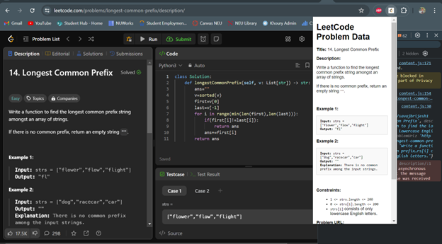
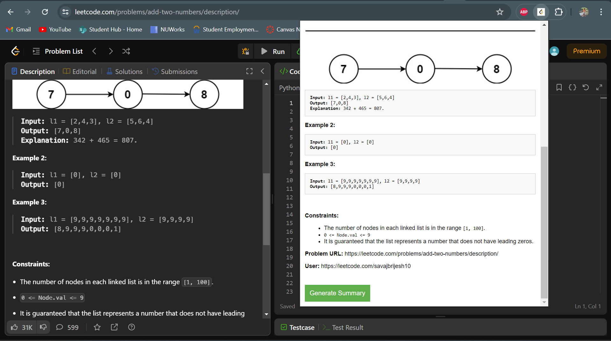
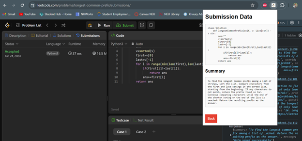


